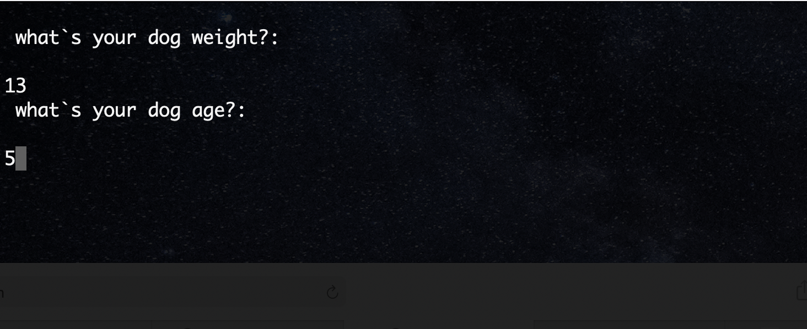
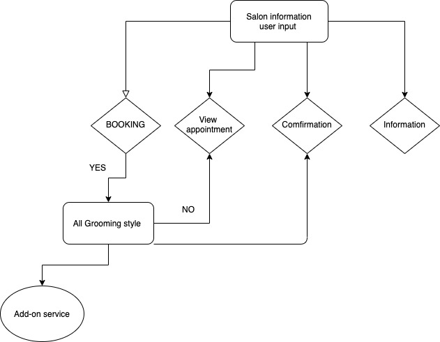

# Fluffy Tails 
Thats the name of my app Fluffy Tails Grooming Salon created by me Job Alvarez Chow 

# GITHUB Link to my Respository 

The Link to My Respository [Click](https://github.com/jobitoalv/app2.git)

# Description 

The main purpose of the app is for any grooming salon wanted to use an user-friendly app to interact with their customer. Customers will be able to make booking , veiw booking, view services .
As a dog lover I know how good it feels when you can find a easy to use app to make your bookings online .

# Target Audience

Anyone who love their dogs as mush as I do . different grooming salons cause I know how to change the logo to fit their needs add different style. 

# Why Use Fluffy Tails 

Easy to manage, Clean and easy to red code, Contantly updating features, colorful Logo, you dont have to be a computer geek to work the app or install the app. 

# User Interaction and Experience

THE App will start with a welcoming Message to the grooming salon of your choice with a bright and colorful log , next you will be ask to input your dog`s name, after entering your dog`s name it will than ask you for you dog`s weight if you enter the wrong weight or anything random an error message will appear, it will wait for you to enter the correct information to continue, now enter the dog`s age same thing will happened if you input the incorrect details or number. When you have entered all teh correct details you will be greeting by a "wooff wooff name of dog line" and the page where you can select from the the options of your choices. Which for my app are Make a booking , veiw a booking , view services and exit . Most of the selection from this page will be used control by TTY-PROMPT which minimize the error input from user.  

# Features

- User can input their dog`s name for a more personalise experience
The user is promted to enter their dog`s name. From there they are present with a menu prompt where they can select new booking.

- User can select from different services 

In this Page user will be able to Select from different Services such as Booking a service , Existing Service, View Services, Salon information and Exit 

When making a booking user are giving 3 options to select from.

They are then prompt to select the day they want for their service.

The Bookiing are created and Booking comfirmation is shown.

- User can check what days are available and not fully booked 
when the day is fully booked you will see an X on the day so user won`t be able to seclect that day

- User Will be able to press any Key to return to main meun.

- If user has created a booking they can select to view exsiting booking, and their booking will be displayed , otherwwise they are advised that they do not yet have a booking and they will be prompted to return to main meun to select Make a booking.

- user can exit at anytime 
The App will display a personalise message on exit depending on if you have made a booking or not 

### Exit out 1 after making a booking 

### Exit out 2 without making any booking 

# Flow Chart and Diagram

Basic flow chart 

Diagram 

# Planning Process plus future updates 

When I heard that we were creating an app the first idea came up was an dog app cause I was gonna get my dogs groom the next day. At first I wanted to add a lot more funtions such as Add Ons, buying products etc.

I felt that it was more important to keep the app simple so that it would be accessible for my target audience and easier for me to be able to make future updates with the two features I mention above Add ons and products for sale. 

# Trello

I used Trello to organise what u needed to do . I also have a label for future enhancment ideas.

The Link to My Trello [Click](https://trello.com/b/9WYUkXMv/terminal-app)

# Help Documentation

You can find installation instructions here: [HELP DOC](https://github.com/jobitoalv/app2/blob/main/Docs/help.md)